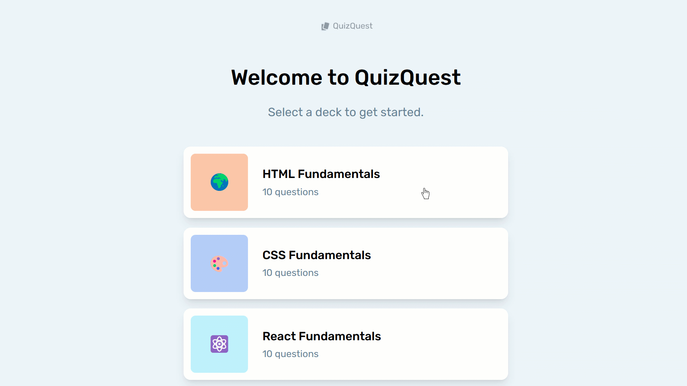
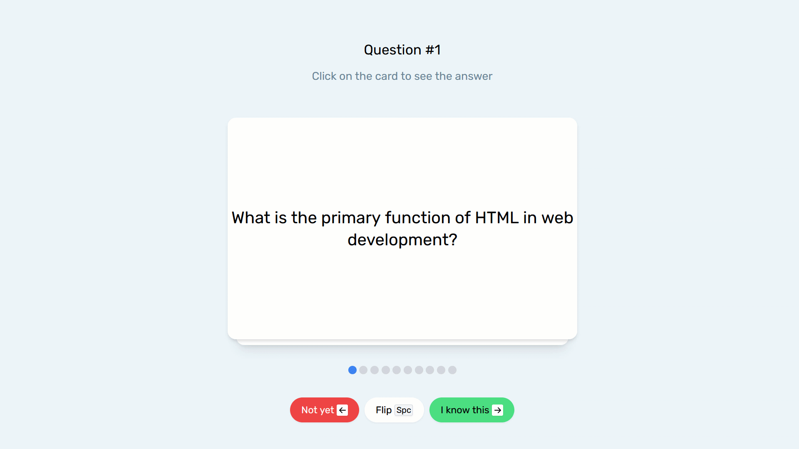
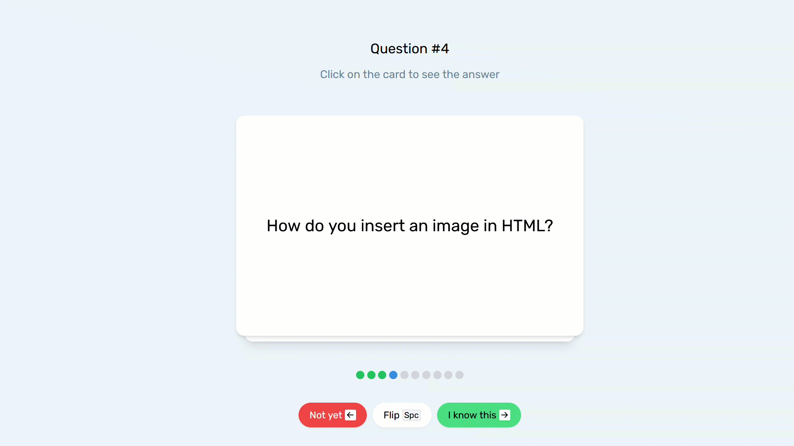
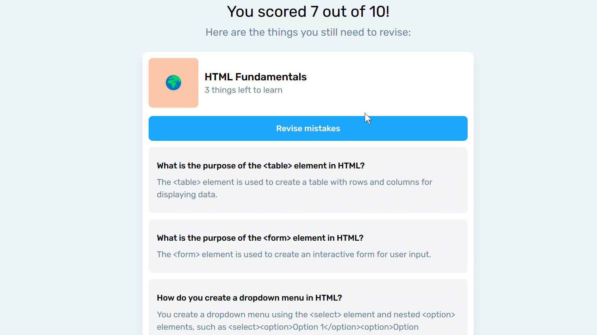

QuizQuest will help you grow as a developer.

## Features

- Practice programming concepts with flashcards.
- Mark cards as correct or incorrect in practice mode.
- View statistics after a practice session.

## Usage

To use the app, navigate to the homepage, select a deck and start learning. You decide whether you know the anwser or not. You can view the answer by pressing Spacebar or clicking on flashcard.
When you are done with all the flashcards, a summary will appear where you decide if you want to practice more with a deck limited to previous mistakes, or if you'd like to start over.

### Browse through multiple courses

### Select a course to view questions

### Press Spacebar to view the answer

### Decide if you know the answer or not using arrow keys

### When you finish the course, you receive the summary

### You can revise your mistakes

### Congratulations! You have mastered the course!

## Technologies Used
- React
- React Router
- Redux
- Vite
- Tailwind
- Testing Library
- Vitest

## Installation
- Clone the repository using `https://github.com/lfilipiuk/quizquest.git`
- Install the required dependencies using `npm install`
- Start the development server using `npm start`
- Access the app at http://localhost:5173/

## Contributing

I welcome all contributions, including bug reports, feature requests, and pull requests.
